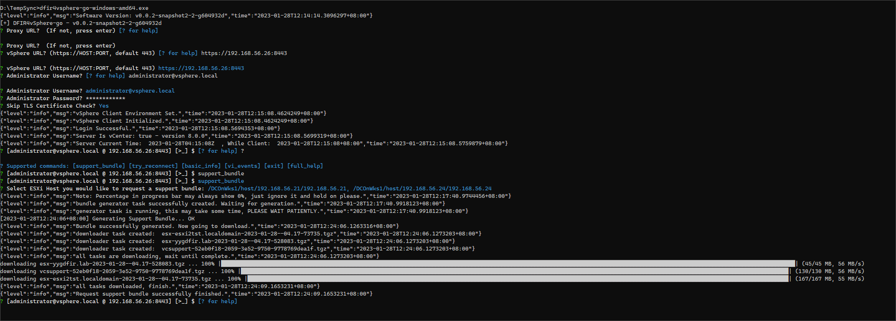
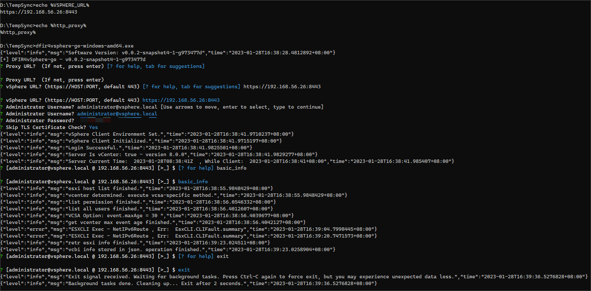
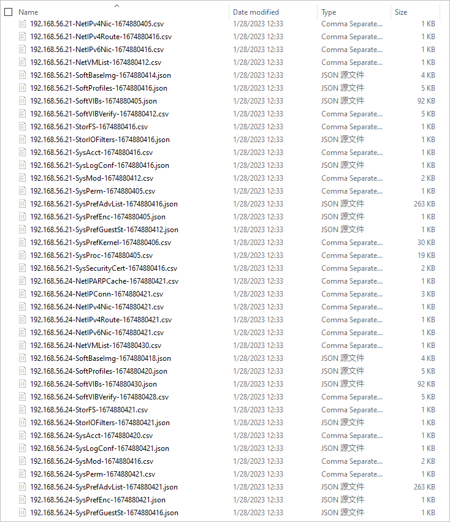
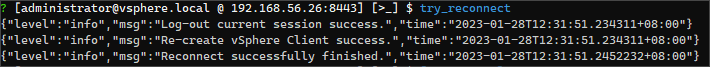
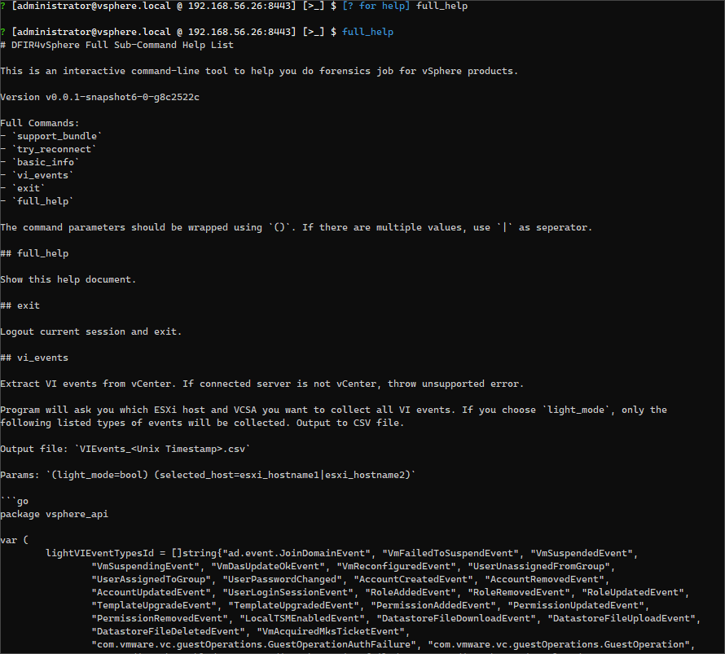
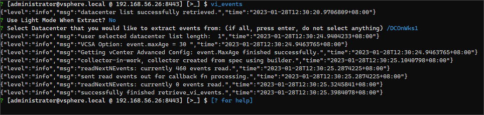

# DFIR4vSphere-go

DFIR4vSphere Golang Implementation

v0.1.2 should be a working version. Report to Issue if any problem has been discovered.

# Build and Compile

Build:

```shell
./scripts/cleanup.sh
go mod download
go mod tidy
./scripts/build.sh
```

# Usage

The program will read `http_proxy` and `VSPHERE_URL` environment variables to suggest you for some input.

For detailed commands: Check [full help docs](/pkg/subcmds/full-help.md).

Please only use `exit` command for exit, if not necessary, do not use Ctrl-C to exit directly.

## Help! I can't log in to vCenter or VCSA or ESXi Management, What should I do for resetting or unlocking?

- for VCSA root account: https://kb.vmware.com/s/article/2147144
- for ESXi host: https://kb.vmware.com/s/article/1317898
- for vCenter SSO accounts (like `administrator@vsphere.local`): https://kb.vmware.com/s/article/2146224

# Debug

Try: https://github.com/vmware/govmomi/tree/main/vcsim which mocked a vCenter API.

# Features

1. Retrieve support bundle: 
2. Each ESXi Host Information Retrieving:  
3. Reconnect: 
4. Show Full Help: 
5. VI Events Log Retrieving: 

# Privacy

Your usage data will be collected for usage telemetry if you use prebuilt binary.

All data are stored in database hosted on Cloudflare, 
those data will only be used for verify commercial license, and will not disclose to any third-party.

To opt-out from telemetry: `export IW0ulDL1Ke2OPT0UtFr0MTeLEmETrY=1`

# Example DFIR Artifact

ZSTD compressed virtual disk container:

- Filename: vcsupport-bundle.vhdx.zst
Link：https://pan.quark.cn/s/ab3c50e6c5ff
Passcode：2ZQr

# License

GNU AGPL v3

Additionally:
- You are not allowed to use this program for any commercial purpose without explicit purchase of commercial license.

To purchase commercial license, contact me using [Telegram](https://t.me/GH_Consult_7c88e09_bot) .

All purchase will be divided into 3 parts, 30% for my daily life, 50% to original project authors, 20% donated to Red Cross.

All purchase history will be published in GitHub Wiki specific page.

中国大陆用户: 中国大陆司法实践中承认 AGPLv3/GPLv3 协议具备合同特征，属于民事法律行为，属于《中华人民共和国合同法》调整的范围。

# Original Project (Credit!)

- https://github.com/ANSSI-FR/DFIR4vSphere Licensed under GPLv3.

This project is a GoLang-implementation of above projects, and it cannot be made without their success.